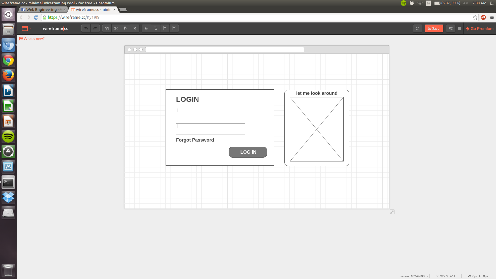
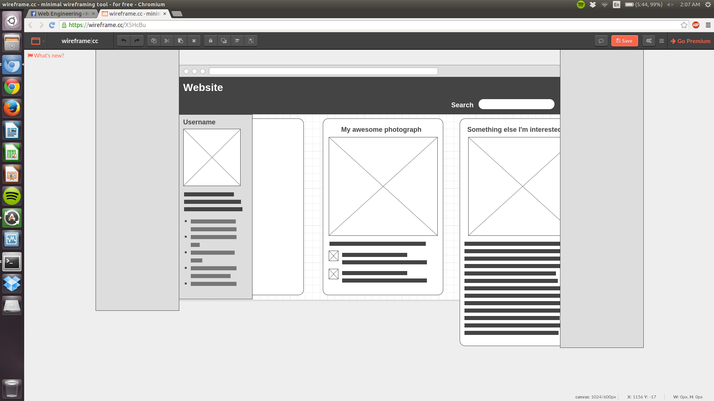

<h1>README</h1>
<h2>By Jay DeStories, Ryan Havens, Nolan Karpinski, and Andrew Burgos</h2>

<h2>Minimum Viable Product Design</h2> 
<a href="https://docs.google.com/spreadsheets/d/1cqydFeEunsNWicqoBGlMNZU-_DaHk2zO5AgAZuJu4hI/edit#gid=0">Data Schema</a> 

<h3>Explanation</h3> 
Users will be represented with a single "users" table, containing personal information, login credentials, and an id (primary key). They will be related with posts, which are unit of content for the site, via the users_post table.  
Posts can contain text, up to one image, and any number of comments. Comments, however, are contained in a separate table, related to posts via the posts_comments table. Both posts and comments are identified by a primary key.  
Posts are expected to have at minimum either some text content or some image content, but neither is mandatory. Images will be stored on a cdn, most likely Amazon S3. This will reduce the load on our SQL database versus storing them there.  
Text posts are capped at a maximum of 200 characters. This is likely enough space for the type of content we expect to encounter, and could later be expanded.  
Images are indexed by a 1024-bit key, because that is the key length used by Amazon S3, which will most likely be used for image hosting.  
The choice to use separate tables to relate users with posts and posts with comments provides a lot of extra flexibility for new features in the future. For example, there could at some point be a page that displays trending posts, where posts would be organized not by users, but by some other classification.  

<h3>Wireframes</h3> 

Login Screen 

Home Screen
